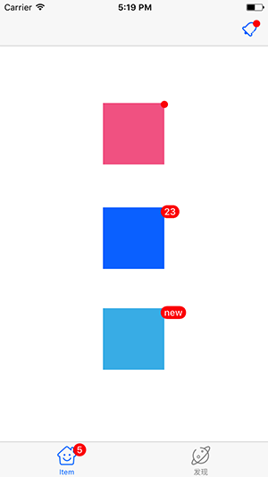

## YLBadge
YLBadge is a delightful library for iOS to show a badge on UIView, UIBarButtonItem and UITabBarItem.

## Overview


## Usage
```objective-c
#import "YLBadge.h"

// show ret dot
[self.testView yl_showBadge];

// show number
[self.testView2 yl_showBadgeNumber:23];

// show text
[self.textView3 yl_showBadgeText:@"new"];

// clear
[self.textView3 yl_clearBadge];
```


#### Global configuration

```objective-c
// setup just like UINavigationBar

YLBadge *appearance = [YLBadge appearance];
appearance.backgroundColor = [UIColor orangeColor];
appearance.textColor = [UIColor yellowColor];
appearance.alignment = YLBadgeAlignmentBottomRight;

```


#### Config someone badge

```objective-c
self.testView.yl_badge.backgroundColor = [UIColor orangeColor];
self.testView.yl_badge.maxDigit = 3;
```


#### Badge for anywhere

You can create instance of YLBadge, and then add it to anywhere such as UITableViewCell.


## Installation

If you use Cocoapods, add `pod 'YLBadge', '~> 1.0.1'` to  your Podfile.

If not,  just add the folder YLBadge to your project. There are no further requirements.


## License

YLBadge is released under the MIT license. See [LICENSE](./LICENSE) for details.
